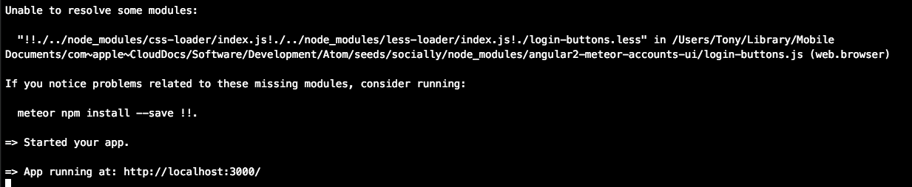
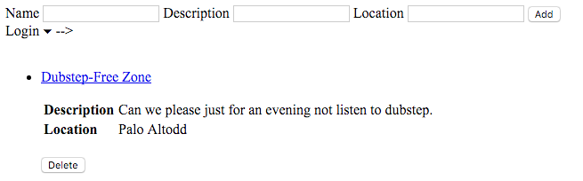
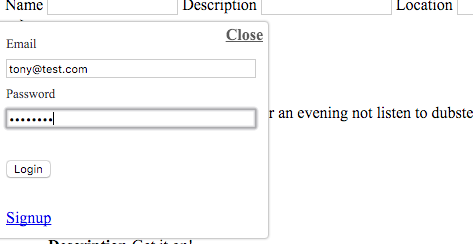
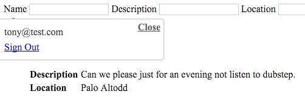

<h2>Angular2 Meteor Tutorial</h4>
<h6><b>Building Socially Tutorial App<b><h6>

<b>30 april 2016</b>

<b>Information</b>
<ul>
    <li>The code in this app may not work for you.</li>
    <li>Am having trouble with getting the logon buttons working on the party-list page.</li>    
    <li>I try to learn Angular2 and Meteor to create awesome apps.</li>    
    <li>Diving into this code, may help others.</li>  
</ul>

<b>Issue</b>
<a href="https://github.com/Urigo/angular2-meteor-accounts-ui/issues/2">angular2-meteor-accounts-ui</a>

<b>Error</b>

<b>Workarround</b>
<ul>
    <li>meteor npm install --save css-loader</li>
</ul>

<b>Screenshot of working Logon Form with buttons</b>
</login-buttons>">

<b>parties-list.html</b>
<pre id="presourcecode_23977" class="displaysourcecode" >
&lt;div&gt;
  &lt;parties-form&gt;&lt;/parties-form&gt;
  <b>&lt;login-buttons&gt;&lt;/login-buttons&gt;</b>
  &lt;p&gt;
  &lt;ul&gt;
    &lt;br&gt;
     &lt;li *ngFor="#party of parties"&gt;
          &lt;a [routerLink]="['/PartyDetails', {partyId: party._id}]"&gt;{{party.name}}&lt;/a&gt;
          &lt;p&gt;&lt;/p&gt;
          &lt;table&gt;
            &lt;tr&gt;
            &lt;td&gt;&lt;b&gt;Description&lt;/b&gt;&lt;/td&gt;
            &lt;td&gt;{{party.description}}&lt;/td&gt;
          &lt;/tr&gt;
          &lt;tr&gt;
            &lt;td&gt;&lt;b&gt;Location&lt;/b&gt;&lt;/td&gt;
            &lt;td&gt;{{party.location}}&lt;/td&gt;
          &lt;/tr&gt;
          &lt;/table&gt;
          &lt;br&gt;
          &lt;button (click)="removeParty(party)"&gt;Delete&lt;/button&gt;
          &lt;p&gt;&lt;/p&gt;
    &lt;/li&gt;
    &lt;br&gt;
  &lt;/ul&gt;
&lt;/div&gt;
</pre>
